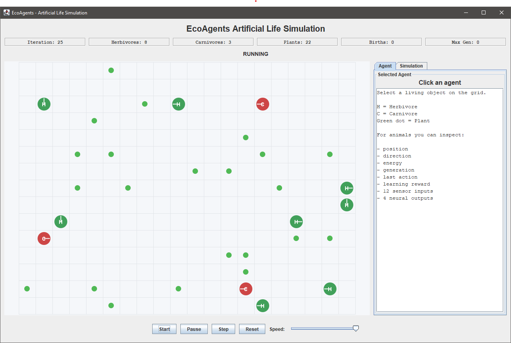
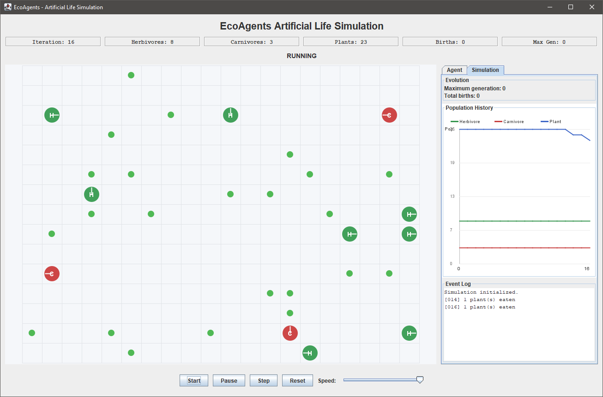

# EcoAgents

**EcoAgents** is a Java-based artificial-life and multi-agent ecosystem simulation featuring autonomous herbivores, carnivores, and plants.

Each animal perceives only its local environment, processes sensory information using a neural decision system, chooses an action, receives reinforcement feedback, learns during its lifetime, consumes energy, and may reproduce by passing an inherited and mutated neural network to the next generation.

The project also includes an interactive Java Swing interface for observing the ecosystem, inspecting individual agents, monitoring population changes, and visualizing evolutionary events.

---

## Application Preview

### Interactive Agent Inspection



The main interface displays the artificial ecosystem on a toroidal grid.

Living animals can be selected directly from the environment to inspect their internal state, including their position, direction, energy, generation, sensor values, neural outputs, selected action, and learning reward.

### Population and Evolution Monitoring



The simulation dashboard provides live population monitoring, total births, maximum generation, population history, and an event log.

---

## Main Features

- Toroidal grid environment
- Autonomous Herbivore agents
- Autonomous Carnivore agents
- Plant resources
- Local perception system
- 12 sensor inputs
- 4 neural outputs
- Winner-takes-all neural decision making
- Energy and metabolism
- Herbivore feeding
- Carnivore hunting
- Reinforcement-based neural adaptation
- Exploration during decision making
- Reproduction
- Neural-network inheritance
- Mutation
- Generation tracking
- Population history visualization
- Event logging
- Interactive agent inspection
- Java Swing graphical interface
- Start, Pause, Step, Reset, and Speed controls

---

## Artificial Life Cycle

Each autonomous animal follows the general cycle:

```text
Environment
    ↓
Sensors
    ↓
Neural Brain
    ↓
Action Selection
    ↓
Action
    ↓
Reward
    ↓
Learning
    ↓
Energy Update
    ↓
Reproduction
```

This architecture combines:

```text
Local perception
+
Neural decision making
+
Lifetime learning
+
Energy-based survival
+
Evolution between generations
```

---

## Ecosystem

The ecosystem contains three main entity types:

```text
Herbivore
Carnivore
Plant
```

### Herbivore

Herbivores search for and consume plants.

A Herbivore can:

- turn left
- turn right
- move forward
- eat nearby plants
- gain energy
- learn from feedback
- reproduce
- transfer its neural parameters to offspring

Successful plant consumption provides:

```text
+1 energy
```

### Carnivore

Carnivores search for and hunt Herbivores.

A Carnivore can:

- turn left
- turn right
- move forward
- hunt nearby Herbivores
- gain energy
- learn from feedback
- reproduce
- transfer its neural parameters to offspring

Successful hunting provides:

```text
+2 energy
```

### Plant

Plants are static environmental resources.

Plants:

- occupy grid cells
- do not move
- do not contain a neural network
- do not make decisions
- can be consumed by Herbivores

---

## Toroidal Environment

The artificial world uses a two-dimensional **toroidal grid**.

There are no hard borders.

When an agent crosses one edge of the environment, it appears on the opposite side.

Examples:

```text
Right edge  → Left edge
Left edge   → Right edge
Top edge    → Bottom edge
Bottom edge → Top edge
```

Example:

```text
(3, 11) + EAST → (3, 0)
```

This creates a continuous artificial world without boundary walls.

---

## Sensor System

Animals cannot observe the entire environment.

They only receive information from local sensor regions:

```text
Front
Left
Right
Nearness
```

Each region detects three entity types:

```text
Herbivore
Carnivore
Plant
```

Therefore:

```text
4 regions × 3 entity types = 12 neural inputs
```

The input vector is:

```text
HF CF PF
HL CL PL
HR CR PR
HN CN PN
```

| Input | Meaning                 |
| ----- | ----------------------- |
| HF    | Herbivores in Front     |
| CF    | Carnivores in Front     |
| PF    | Plants in Front         |
| HL    | Herbivores on the Left  |
| CL    | Carnivores on the Left  |
| PL    | Plants on the Left      |
| HR    | Herbivores on the Right |
| CR    | Carnivores on the Right |
| PR    | Plants on the Right     |
| HN    | Herbivores in Nearness  |
| CN    | Carnivores in Nearness  |
| PN    | Plants in Nearness      |

### Nearness

In the current implementation, Nearness consists of the eight cells directly surrounding the animal.

```text
N N N
N A N
N N N
```

Where:

```text
A = Animal
N = Nearness
```

Front, Left, and Right are relative to the animal's current orientation.

---

## Neural Decision System

Every animal owns its own `NeuralBrain`.

The neural system contains:

```text
12 inputs
4 outputs
```

Each output is calculated using:

```text
Output(i) = Bias(i) + Σ Weight(i,j) × Input(j)
```

The four outputs correspond to four actions:

| Neural Output | Action       |
| ------------- | ------------ |
| 0             | TURN_LEFT    |
| 1             | TURN_RIGHT   |
| 2             | MOVE_FORWARD |
| 3             | EAT          |

After calculating all four outputs, the largest value is selected.

This is a **winner-takes-all** decision mechanism.

Example:

```text
TURN_LEFT    = 0.70
TURN_RIGHT   = 0.10
MOVE_FORWARD = 1.50
EAT          = 2.10
```

Result:

```text
Selected Action = EAT
```

---

## Available Actions

Each animal can perform one of four actions:

```text
TURN_LEFT
TURN_RIGHT
MOVE_FORWARD
EAT
```

### TURN_LEFT

Rotates the animal 90 degrees to the left.

### TURN_RIGHT

Rotates the animal 90 degrees to the right.

### MOVE_FORWARD

Moves the animal one cell in its current direction.

Toroidal wrapping is automatically applied.

### EAT

Attempts to consume an edible entity in the local Nearness region.

For Herbivores:

```text
Plant → Food
```

For Carnivores:

```text
Herbivore → Food
```

---

## Reinforcement-Based Learning

Animals can modify their neural parameters during their lifetime.

The implemented learning rule is:

```text
weight =
weight + learningRate × reward × input
```

The bias of the selected action is also updated.

Current learning rate:

```text
0.05
```

Positive rewards reinforce successful behavior.

Negative rewards discourage unsuccessful behavior.

Examples:

```text
Successful EAT       → positive reward
Failed EAT           → negative reward
Successful MOVE      → small positive reward
Blocked MOVE         → negative reward
TURN                 → small penalty
```

---

## Behavioral Reward Shaping

Additional reward shaping helps agents associate sensor information with useful actions.

### Herbivore

```text
Plant in Nearness → EAT
Plant in Front    → MOVE_FORWARD
Plant on Left     → TURN_LEFT
Plant on Right    → TURN_RIGHT
```

### Carnivore

```text
Herbivore in Nearness → EAT
Herbivore in Front    → MOVE_FORWARD
Herbivore on Left     → TURN_LEFT
Herbivore on Right    → TURN_RIGHT
```

---

## Exploration

Using only the current neural winner may cause an agent to repeat the same behavior indefinitely.

The simulation therefore uses a small exploration probability:

```text
10%
```

Conceptually:

```text
90% → neural decision
10% → exploratory random action
```

Exploration is enabled during the ecosystem simulation.

Deterministic tests can disable exploration.

---

## Energy System

Each animal has:

```text
Maximum Energy = 20.0
Initial Energy = 16.0
```

Every active iteration consumes:

```text
0.02 energy
```

Food restores energy:

```text
Herbivore eats Plant     → +1 energy
Carnivore eats Herbivore → +2 energy
```

Energy is limited to the maximum value.

If an animal's energy reaches zero, the animal dies.

---

## Reproduction

An animal becomes eligible for reproduction when its energy reaches at least:

```text
90% of maximum energy
```

With maximum energy equal to 20:

```text
20 × 0.90 = 18
```

Therefore:

```text
Energy >= 18
```

allows reproduction.

The reproduction process is:

```text
Parent reaches energy threshold
             ↓
Find empty neighboring cell
             ↓
Copy parent's neural network
             ↓
Apply mutation
             ↓
Create offspring
             ↓
Increase generation
             ↓
Transfer energy
```

The offspring receives:

```text
40% of maximum energy
```

Therefore:

```text
Child Energy = 8
```

Example:

```text
Parent energy before = 18
Child energy         = 8
Parent energy after  = 10
```

---

## Neural Inheritance

The offspring receives a copy of the parent's current neural parameters.

This includes:

```text
Weights
Biases
```

Because the parent can learn during its lifetime, the copied network contains the parent's current adapted values.

The new child belongs to the next generation.

Example:

```text
Parent Generation = 0
Child Generation  = 1
```

---

## Mutation

After neural inheritance, small random mutations are applied to the child's neural parameters.

Current configuration:

```text
Mutation probability = 10%
Mutation magnitude   = 0.10
```

This creates small differences between parent and offspring.

The model therefore combines:

```text
Lifetime Learning
+
Inheritance
+
Mutation
```

---

## Simulation Configuration

Current default ecosystem configuration:

```text
Grid Rows          = 15
Grid Columns       = 20

Initial Herbivores = 8
Initial Carnivores = 3
Initial Plants     = 25

Maximum Iterations = 400
```

The default GUI simulation uses:

```text
Seed = 42
```

A fixed seed makes development and testing reproducible.

---

## Graphical User Interface

EcoAgents includes an interactive graphical interface implemented using **Java Swing**.

The interface provides:

- ecosystem grid
- current iteration
- Herbivore population
- Carnivore population
- Plant population
- total births
- maximum generation
- simulation status
- speed control
- agent inspection
- population history
- event log

---

## Simulation Controls

### Start

Starts automatic execution.

### Pause

Pauses execution.

### Step

Executes one simulation iteration.

### Reset

Creates a fresh simulation using the default seed.

### Speed

Changes the delay between simulation iterations.

---

## Agent Inspector

A living entity can be selected directly from the grid.

For animals, the inspector shows:

- animal type
- alive status
- position
- direction
- energy
- energy percentage
- generation
- last action
- selected neural action
- learning reward
- 12 sensor inputs
- 4 neural outputs

This makes the internal state of autonomous agents visible while the simulation is running.

---

## Population History

The Simulation tab contains a live population chart.

It records:

```text
Herbivore population
Carnivore population
Plant population
```

over simulation time.

The chart helps visualize ecosystem changes.

---

## Event Log

Important ecosystem events are recorded.

Examples:

```text
[014] 1 plant(s) eaten
[056] 1 herbivore(s) lost
[121] 1 new offspring born
```

The Event Log makes population changes easier to understand during demonstrations.

---

## Project Architecture

The project is divided into several packages:

```text
ecoagents
│
├── agents
├── brain
├── environment
├── model
├── simulation
└── ui
```

A detailed architecture description is available here:

[Architecture Documentation](docs/architecture.md)

---

## Project Structure

```text
EcoAgents/
│
├── .gitignore
├── LICENSE
├── README.md
│
├── docs/
│   ├── architecture.md
│   └── screenshots/
│       ├── main-interface.png
│       └── simulation-analysis.png
│
└── src/
    └── ecoagents/
        │
        ├── Main.java
        │
        ├── ToroidalTest.java
        ├── DirectionTest.java
        ├── SensorTest.java
        ├── NeuralBrainTest.java
        ├── AnimalBrainTest.java
        ├── LearningTest.java
        ├── NearnessEatTest.java
        ├── ReproductionTest.java
        ├── SimulationTest.java
        ├── EcosystemBalanceTest.java
        │
        ├── agents/
        │   ├── Agent.java
        │   ├── Animal.java
        │   ├── Herbivore.java
        │   ├── Carnivore.java
        │   └── Plant.java
        │
        ├── brain/
        │   └── NeuralBrain.java
        │
        ├── environment/
        │   └── Environment.java
        │
        ├── model/
        │   ├── Action.java
        │   ├── Direction.java
        │   ├── Position.java
        │   └── SensorData.java
        │
        ├── simulation/
        │   ├── Simulation.java
        │   └── SimulationConfig.java
        │
        └── ui/
            ├── GameFrame.java
            ├── EnvironmentPanel.java
            ├── AgentDetailsPanel.java
            ├── SimulationInfoPanel.java
            └── PopulationChartPanel.java
```

---

## Requirements

The project requires:

```text
Java Development Kit 21+
```

The project has been developed and tested using:

```text
Temurin JDK 21
```

No external Java libraries are required.

The graphical interface uses the standard Java Swing library.

---

## Compile

Open CMD and navigate to the project directory:

```cmd
cd /d G:\Projects\Uni-Projects\EcoAgents
```

Remove the previous compilation directory:

```cmd
rmdir /s /q out
```

Create a clean output directory:

```cmd
mkdir out
```

Compile:

```cmd
javac -d out src\ecoagents\model\*.java src\ecoagents\brain\*.java src\ecoagents\environment\*.java src\ecoagents\agents\*.java src\ecoagents\simulation\*.java src\ecoagents\ui\*.java src\ecoagents\*.java
```

---

## Run

Start the graphical application:

```cmd
java -cp out ecoagents.Main
```

---

## Tests

The project contains regression and subsystem tests.

### Toroidal Environment

```cmd
java -cp out ecoagents.ToroidalTest
```

### Direction System

```cmd
java -cp out ecoagents.DirectionTest
```

### Sensor System

```cmd
java -cp out ecoagents.SensorTest
```

### Neural Brain

```cmd
java -cp out ecoagents.NeuralBrainTest
```

### Animal-Brain Integration

```cmd
java -cp out ecoagents.AnimalBrainTest
```

### Learning

```cmd
java -cp out ecoagents.LearningTest
```

### Nearness Interaction

```cmd
java -cp out ecoagents.NearnessEatTest
```

### Reproduction

```cmd
java -cp out ecoagents.ReproductionTest
```

### Simulation

```cmd
java -cp out ecoagents.SimulationTest
```

### Complete Ecosystem

```cmd
java -cp out ecoagents.EcosystemBalanceTest
```

---

## Validated Results

All major project subsystems have been tested successfully.

Validated functionality includes:

```text
Toroidal movement             PASS
Direction handling            PASS
Local sensor system           PASS
12-input perception           PASS
Neural calculation            PASS
Winner-takes-all selection    PASS
Herbivore feeding             PASS
Carnivore hunting             PASS
Energy metabolism             PASS
Reinforcement learning        PASS
Nearness interaction          PASS
Reproduction                  PASS
Neural inheritance            PASS
Mutation                      PASS
Full ecosystem simulation     PASS
Graphical interface           PASS
```

---

## Example Learning Result

A controlled learning test produced:

```text
EAT output before = 1.0000
Learning reward   = 1.50
EAT output after  = 1.1500
```

Result:

```text
PASS: successful EAT was reinforced.
```

---

## Example Reproduction Result

A controlled reproduction test produced:

```text
Parent energy before = 18.00 / 20.00
Parent generation    = 0

Child generation     = 1
Child energy         = 8.00 / 20.00
Parent energy after  = 10.00 / 20.00

Changed neural parameters = 7
Maximum mutation          = 0.0931
```

Result:

```text
PASS: reproduction, inheritance and mutation work.
```

---

## Full Ecosystem Result

Using:

```text
Seed = 42
```

natural reproduction occurred during the complete simulation.

At iteration:

```text
121
```

the ecosystem reached:

```text
Births         = 1
Max Generation = 1
```

The complete simulation continued successfully to:

```text
Iteration 400
```

Example final state:

```text
Herbivores     = 4
Carnivores     = 3
Plants         = 2
Births         = 1
Max Generation = 1
```

Result:

```text
PASS: reproduction occurred in the ecosystem.
```

---

## Technologies and Concepts

EcoAgents demonstrates concepts from:

- Java 21
- Java Swing
- Object-Oriented Programming
- Artificial Life
- Multi-Agent Systems
- Agent-Based Modeling
- Neural Networks
- Reinforcement-Based Learning
- Evolutionary Adaptation
- Simulation Modeling

---

## Design Decisions

Several values in EcoAgents are implementation choices used to create a demonstrable artificial-life simulation.

Examples include:

```text
Nearness = 8 neighboring cells

Learning rate = 0.05

Exploration probability = 10%

Initial energy = 16

Maximum energy = 20

Metabolism cost = 0.02

Reproduction threshold = 90%

Offspring energy = 8

Mutation probability = 10%

Mutation magnitude = 0.10
```

These parameters can be modified in future experiments.

---

## Future Improvements

Possible extensions include:

- plant regeneration
- longer evolutionary experiments
- additional animal species
- configurable simulation parameters
- CSV statistics export
- experiment comparison across multiple random seeds
- neural-weight visualization
- more advanced reinforcement-learning methods
- hidden neural layers
- genetic crossover
- adaptive mutation
- persistent simulation history

---

## Author

**Mohammad Azimi**

Master's Program in Intelligent Systems
